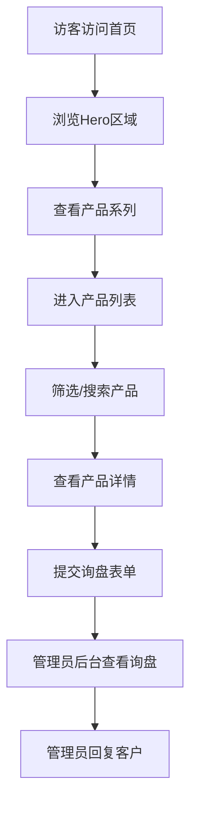

# 假发外贸展示平台 - 产品需求文档

## 1. 产品概述

为假发外贸出口企业打造的专业产品展示与管理系统，面向美国及欧洲市场。前端展示网站以高端时尚感呈现假发产品系列，后台管理系统提供简洁直观的产品、分类、订单及内容管理功能，帮助企业高效运营海外B2B业务。

目标用户：海外批发商、零售商、美发沙龙及终端消费者。

## 2. 核心功能

### 2.1 用户角色

| 角色 | 注册方式 | 核心权限 |
|------|----------|----------|
| 访客 | 无需注册 | 浏览产品、查看详情、联系咨询 |
| 管理员 | 后台登录 | 产品管理、分类管理、订单管理、内容管理、系统设置 |

### 2.2 功能模块

1. **前台展示网站**
   - 首页：品牌展示、产品系列轮播、热门产品、关于我们、联系方式
   - 产品列表页：分类筛选、搜索、产品卡片展示
   - 产品详情页：多图展示、规格参数、产品描述、咨询按钮
   - 关于我们页：公司介绍、工厂实力、品质保障
   - 联系我们页：联系表单、公司信息、地图位置

2. **后台管理系统**
   - 仪表盘：数据概览、快捷入口
   - 产品管理：增删改查、上下架、批量操作
   - 分类管理：产品分类、标签管理
   - 订单/询盘管理：客户询盘记录、跟进状态
   - 内容管理：Banner管理、关于我们内容编辑
   - 系统设置：网站基本信息、SEO设置

### 2.3 页面详情

| 页面名称 | 模块名称 | 功能描述 |
|----------|----------|----------|
| 首页 | Hero区域 | 全屏视频/图片背景，品牌Slogan，CTA按钮 |
| 首页 | 产品系列 | 三大核心系列展示卡片，悬停放大效果 |
| 首页 | 热门产品 | 横向滚动产品展示，快速预览 |
| 首页 | 优势展示 | 工厂实力、品质认证、定制服务图标展示 |
| 首页 | 页脚 | 联系信息、社交媒体链接、快速导航 |
| 产品列表 | 筛选栏 | 按材质、长度、颜色、款式筛选 |
| 产品列表 | 产品网格 | 响应式网格布局，图片懒加载 |
| 产品详情 | 图片画廊 | 主图+缩略图，支持放大查看 |
| 产品详情 | 信息面板 | 产品名称、价格区间、规格参数、描述 |
| 产品详情 | 咨询区域 | 快速询盘表单，WhatsApp/Email直达 |
| 后台首页 | 仪表盘 | 产品数量、询盘数量、访问统计卡片 |
| 后台产品 | 列表管理 | 表格展示、搜索、分页、批量删除 |
| 后台产品 | 编辑表单 | 富文本编辑器、多图上传、规格配置 |

## 3. 核心流程

### 访客浏览流程
访客进入首页 → 浏览产品系列 → 进入产品列表 → 筛选/搜索产品 → 查看产品详情 → 提交询盘/联系咨询

### 管理员操作流程
管理员登录后台 → 查看仪表盘数据 → 管理产品（新增/编辑/删除）→ 管理分类 → 查看询盘 → 回复客户

## 4. 用户界面设计

### 4.1 设计风格

- **整体风格**：高端时尚杂志风，兼具工业质感与柔美气质，体现假发行业的时尚属性
- **主色调**：深邃黑 (#0A0A0A) + 香槟金 (#D4AF37) + 纯净白 (#FFFFFF)
- **辅助色**：暖灰 (#6B6B6B)、浅金 (#F5E6C8)
- **按钮样式**：圆角矩形(8px)，主按钮香槟金背景+黑字，次按钮透明边框+金边
- **字体**：
  - 英文标题：Playfair Display（衬线体，优雅时尚）
  - 英文正文：DM Sans（无衬线，清晰易读）
  - 中文标题：思源宋体
  - 中文正文：思源黑体
- **布局风格**：大面积留白，非对称网格，图文交错排列，单页滚动叙事
- **图标风格**：线性图标，1.5px描边，圆角端点

### 4.2 页面设计概述

| 页面名称 | 模块名称 | UI元素 |
|----------|----------|--------|
| 首页 | Hero区域 | 全屏背景图，渐变遮罩，居中标题，底部滚动提示 |
| 首页 | 产品系列 | 三列卡片，悬停时图片放大1.05倍，显示系列名称 |
| 首页 | 热门产品 | 横向滚动容器，产品卡片带阴影，价格标签 |
| 首页 | 优势展示 | 四列图标+文字，悬停时图标金色高亮 |
| 首页 | 页脚 | 深色背景，三列布局，社交媒体图标 |
| 产品列表 | 筛选栏 | 左侧固定，复选框筛选，价格区间滑块 |
| 产品列表 | 产品网格 | 三列网格，卡片圆角12px，图片比例3:4 |
| 产品详情 | 图片画廊 | 左侧大图占60%，右侧缩略图列表 |
| 产品详情 | 信息面板 | 标题大号衬线体，价格金色突出，表格规格 |
| 后台首页 | 仪表盘 | 四列统计卡片，快捷操作按钮组 |
| 后台产品 | 列表 | 表格行悬停高亮，操作按钮下拉菜单 |
| 后台产品 | 编辑 | 分步表单，图片拖拽上传，标签输入 |

### 4.3 响应式设计

- **桌面端**（>1024px）：完整布局，侧边栏筛选，三列产品网格
- **平板端**（768-1024px）：两列网格，折叠菜单，简化动画
- **移动端**（<768px）：单列布局，底部固定导航，全屏筛选抽屉

### 4.4 动画与交互

- **页面加载**：标题文字逐字淡入（stagger 0.05s），产品卡片从下方滑入
- **滚动触发**：元素进入视口时触发淡入+上移动画，使用Intersection Observer
- **悬停效果**：产品卡片阴影加深+轻微上移(translateY -4px)，图片放大
- **页面过渡**：路由切换时淡入淡出，300ms ease-in-out
- **微交互**：按钮点击时轻微缩放(0.98)，加载状态旋转动画

---

## 5. 创意亮点

1. **发丝流动动画**：首页Hero区域背景使用CSS实现发丝般的流动线条动画，呼应假发行业特性
2. **产品试戴概念展示**：产品详情页使用分层图片展示，模拟假发佩戴效果
3. **色板交互**：颜色筛选使用真实发色色板，点击后产品实时过滤
4. **杂志式排版**：产品展示采用时尚杂志的大图+精简文字排版，提升品牌调性
5. **金色点缀动效**：关键交互点（如加入询盘、提交成功）使用金色粒子爆发效果
