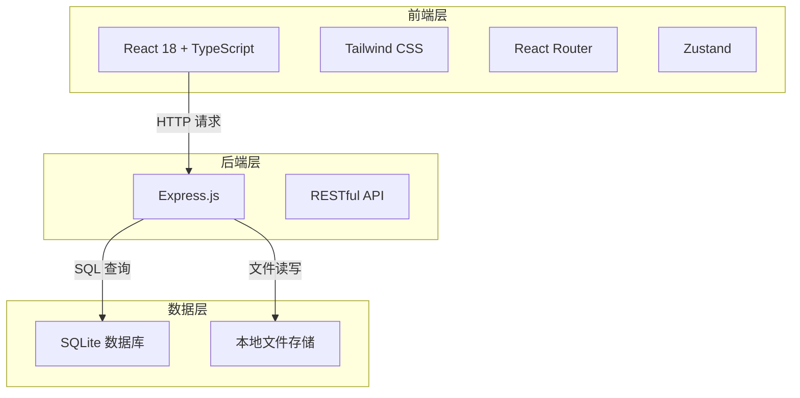
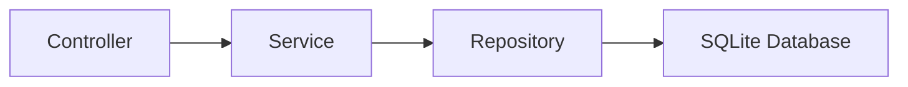
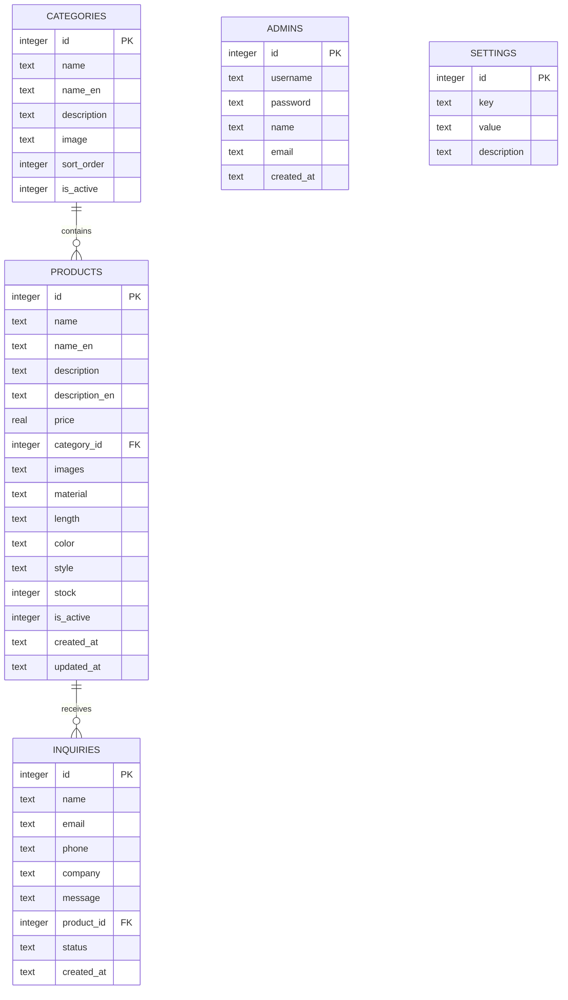

# 假发外贸展示平台 - 技术架构文档

## 1. 架构设计



## 2. 技术选型

- **前端框架**：React 18 + TypeScript
- **构建工具**：Vite
- **样式方案**：Tailwind CSS 3
- **状态管理**：Zustand
- **路由**：React Router DOM v6
- **图标库**：Lucide React
- **后端框架**：Express.js 4 (TypeScript)
- **数据库**：SQLite3 (轻量级，无需额外服务)
- **文件上传**：Multer
- **密码加密**：bcryptjs
- **认证**：JWT (jsonwebtoken)

## 3. 路由定义

### 前台路由

| 路由 | 用途 |
|------|------|
| / | 首页 |
| /products | 产品列表页 |
| /products/:id | 产品详情页 |
| /about | 关于我们 |
| /contact | 联系我们 |

### 后台路由

| 路由 | 用途 |
|------|------|
| /admin/login | 管理员登录 |
| /admin/dashboard | 仪表盘 |
| /admin/products | 产品管理 |
| /admin/products/new | 新增产品 |
| /admin/products/edit/:id | 编辑产品 |
| /admin/categories | 分类管理 |
| /admin/inquiries | 询盘管理 |
| /admin/settings | 系统设置 |

### API 路由

| 路由 | 方法 | 用途 |
|------|------|------|
| /api/auth/login | POST | 管理员登录 |
| /api/auth/me | GET | 获取当前用户 |
| /api/products | GET | 获取产品列表 |
| /api/products | POST | 创建产品 |
| /api/products/:id | GET | 获取产品详情 |
| /api/products/:id | PUT | 更新产品 |
| /api/products/:id | DELETE | 删除产品 |
| /api/categories | GET | 获取分类列表 |
| /api/categories | POST | 创建分类 |
| /api/categories/:id | PUT | 更新分类 |
| /api/categories/:id | DELETE | 删除分类 |
| /api/inquiries | GET | 获取询盘列表 |
| /api/inquiries | POST | 提交询盘 |
| /api/inquiries/:id | PUT | 更新询盘状态 |
| /api/upload | POST | 上传图片 |

## 4. API 定义

### 产品 (Product)

```typescript
interface Product {
  id: number;
  name: string;
  nameEn: string;
  description: string;
  descriptionEn: string;
  price: number;
  categoryId: number;
  images: string[];
  material: string;
  length: string;
  color: string;
  style: string;
  stock: number;
  isActive: boolean;
  createdAt: string;
  updatedAt: string;
}

// GET /api/products
interface GetProductsRequest {
  page?: number;
  limit?: number;
  categoryId?: number;
  search?: string;
  material?: string;
  color?: string;
}

interface GetProductsResponse {
  data: Product[];
  total: number;
  page: number;
  limit: number;
}
```

### 分类 (Category)

```typescript
interface Category {
  id: number;
  name: string;
  nameEn: string;
  description: string;
  image: string;
  sortOrder: number;
  isActive: boolean;
}
```

### 询盘 (Inquiry)

```typescript
interface Inquiry {
  id: number;
  name: string;
  email: string;
  phone: string;
  company: string;
  message: string;
  productId?: number;
  status: 'pending' | 'processing' | 'completed';
  createdAt: string;
}
```

### 管理员 (Admin)

```typescript
interface Admin {
  id: number;
  username: string;
  password: string; // bcrypt 加密
  name: string;
  email: string;
  createdAt: string;
}

// POST /api/auth/login
interface LoginRequest {
  username: string;
  password: string;
}

interface LoginResponse {
  token: string;
  user: Omit<Admin, 'password'>;
}
```

## 5. 服务端架构



- **Controller**：处理 HTTP 请求/响应，参数校验
- **Service**：业务逻辑处理
- **Repository**：数据访问层，SQL 操作

## 6. 数据模型

### 6.1 ER 图



### 6.2 数据库 DDL

```sql
-- 分类表
CREATE TABLE categories (
    id INTEGER PRIMARY KEY AUTOINCREMENT,
    name TEXT NOT NULL,
    name_en TEXT NOT NULL,
    description TEXT,
    image TEXT,
    sort_order INTEGER DEFAULT 0,
    is_active INTEGER DEFAULT 1,
    created_at DATETIME DEFAULT CURRENT_TIMESTAMP
);

-- 产品表
CREATE TABLE products (
    id INTEGER PRIMARY KEY AUTOINCREMENT,
    name TEXT NOT NULL,
    name_en TEXT NOT NULL,
    description TEXT,
    description_en TEXT,
    price REAL,
    category_id INTEGER,
    images TEXT, -- JSON 数组
    material TEXT,
    length TEXT,
    color TEXT,
    style TEXT,
    stock INTEGER DEFAULT 0,
    is_active INTEGER DEFAULT 1,
    created_at DATETIME DEFAULT CURRENT_TIMESTAMP,
    updated_at DATETIME DEFAULT CURRENT_TIMESTAMP,
    FOREIGN KEY (category_id) REFERENCES categories(id)
);

-- 询盘表
CREATE TABLE inquiries (
    id INTEGER PRIMARY KEY AUTOINCREMENT,
    name TEXT NOT NULL,
    email TEXT NOT NULL,
    phone TEXT,
    company TEXT,
    message TEXT NOT NULL,
    product_id INTEGER,
    status TEXT DEFAULT 'pending',
    created_at DATETIME DEFAULT CURRENT_TIMESTAMP,
    FOREIGN KEY (product_id) REFERENCES products(id)
);

-- 管理员表
CREATE TABLE admins (
    id INTEGER PRIMARY KEY AUTOINCREMENT,
    username TEXT UNIQUE NOT NULL,
    password TEXT NOT NULL,
    name TEXT,
    email TEXT,
    created_at DATETIME DEFAULT CURRENT_TIMESTAMP
);

-- 系统设置表
CREATE TABLE settings (
    id INTEGER PRIMARY KEY AUTOINCREMENT,
    key TEXT UNIQUE NOT NULL,
    value TEXT,
    description TEXT
);

-- 初始数据
INSERT INTO admins (username, password, name, email) 
VALUES ('admin', '$2a$10$YourHashedPasswordHere', '管理员', 'admin@example.com');

INSERT INTO categories (name, name_en, description, sort_order) VALUES 
('真人发假发', 'Human Hair Wigs', '100%真人发丝，自然逼真', 1),
('化纤假发', 'Synthetic Wigs', '高品质化纤丝，款式多样', 2),
('发片接发', 'Hair Extensions', '无痕接发，瞬间变长', 3);

INSERT INTO settings (key, value, description) VALUES 
('site_name', 'LuxeHair Wigs', '网站名称'),
('site_description', 'Premium Wig Manufacturer & Exporter', '网站描述'),
('contact_email', 'info@luxehair.com', '联系邮箱'),
('contact_phone', '+86-xxx-xxxx-xxxx', '联系电话');
```

## 7. 项目结构

```
├── api/                          # 后端代码
│   ├── server.ts                 # 服务入口
│   ├── routes/                   # 路由定义
│   │   ├── auth.ts
│   │   ├── products.ts
│   │   ├── categories.ts
│   │   ├── inquiries.ts
│   │   └── upload.ts
│   ├── controllers/              # 控制器
│   ├── services/                 # 业务逻辑
│   ├── middleware/               # 中间件
│   │   ├── auth.ts
│   │   └── upload.ts
│   └── database.ts               # 数据库连接
├── public/                       # 静态资源
│   └── uploads/                  # 上传文件
├── src/
│   ├── components/               # 公共组件
│   ├── pages/                    # 页面组件
│   │   ├── home/                 # 前台首页
│   │   ├── products/             # 产品相关
│   │   ├── about/                # 关于我们
│   │   ├── contact/              # 联系我们
│   │   └── admin/                # 后台管理
│   ├── hooks/                    # 自定义 Hooks
│   ├── stores/                   # Zustand 状态管理
│   ├── types/                    # TypeScript 类型
│   ├── utils/                    # 工具函数
│   ├── App.tsx                   # 根组件
│   └── main.tsx                  # 入口文件
├── .trae/documents/              # 项目文档
├── package.json
├── tsconfig.json
├── vite.config.ts
└── tailwind.config.js
```

## 8. 部署说明

- 前端通过 Vite 构建为静态文件
- 后端 Express 服务同时提供 API 和静态文件托管
- 数据库使用 SQLite，无需额外配置
- 图片上传存储在 `public/uploads` 目录
- 启动命令：`npm run dev`（开发）/ `npm run build && npm start`（生产）
